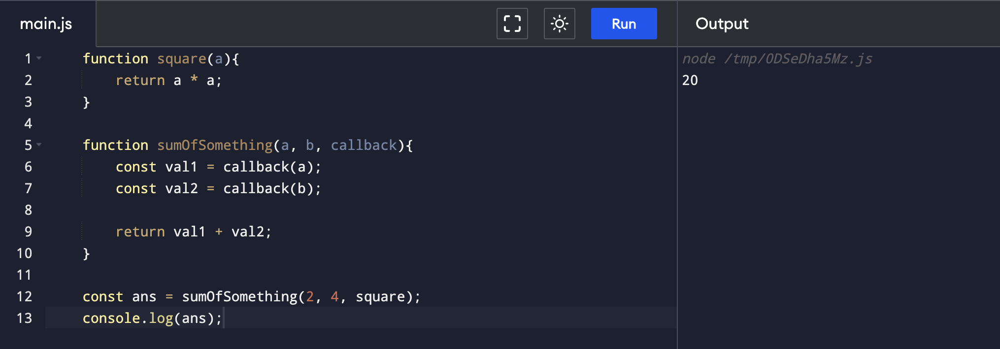

## Callback Function 

- Function: Set of statements that perform a task or calculates a value
- Passing another function inside another function as argument

```js
    function square(a){
        return a * a;
    }

    function sumOfSomething(a, b, callback){
        const val1 = callback(a);
        const val2 = callback(b);

        return val1 + val2;
    }

    const ans = sumOfSomething(2, 4, square);
    console.log(ans);
```


**Output:**




## Anonymous Functions

When the function itself does not have a name. But instead of function name, one passes the whole function body itself.


```js

    function sumOfSomething(a, b, callback){
        const val1 = callback(a);
        const val2 = callback(b);

        return val1 + val2;
    }

    const ans = sumOfSomething(2, 4, function square(a){
        return a * a;
    });
    console.log(ans);
```
