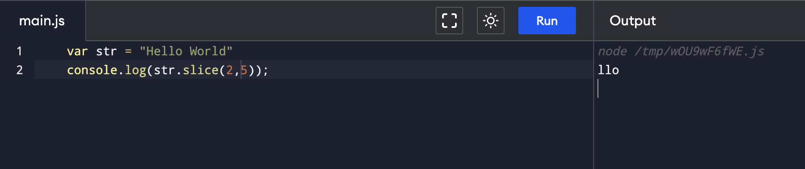

## JS Basic InBuild Functions

### 1. Length of string

``` 
    var str = "Sakshi"
    console.log(str.length)
```

Output:


### 2. Index Of - 

``` 
    var str = "Hello World"
    console.log(str.indexOf("World"));
    
    var str1 = "Hello World World"
    console.log(str1.indexOf("World"));
    
    var str2 = "Hello World World"
    console.log(str2.lastIndexOf("World"));
```


When target not found returns -1

### 3. Slice

```
    var str = "Hello World"
    console.log(str.slice(2,5));
```



End index is not included

### 4. Substring

```
    var str = "Hello World"
    console.log(str.substr(2,5));
```


* Second argument here is length
* It is not alot different from slice when start position is same. But the meaning starts to differ when start position is different.

### 5. Replace

```
    var str = "Hello World"
    console.log(str.replace("World", "Test"));
    
    var str = "Hello World"
    console.log(str.replace("uu", "Test"));
```


### 6. Split

```
    var str = "Hello World. Let's explore"
    console.log(str.split(" "));
    
    var str = "Emma, Is this correct?"
    console.log(str.split(","));
```


### 7. Trim

```
    var str = "       Hello World. Let's explore       "
    console.log(str.trim());
```


### 8. Upper Case

```
    var str = "Hello World"
    console.log(str.toUpperCase());
```


### 9. ToLowerCase

```
    var str = "Hello World"
    console.log(str.toLowerCase());
```


### 10. Parse Integer

```
    var str = "42"
    console.log(parseInt(str));
    
    var str1 = "kjsdhd45"
    console.log(parseInt(str1));
    
    var str2 = "548jhfd"
    console.log(parseInt(str2));

    var str3 = "3.41"
    console.log(parseInt(str3));
```

